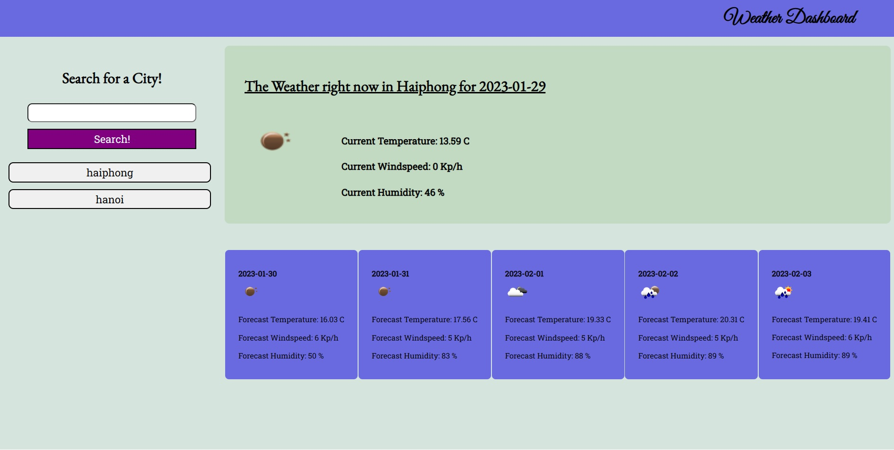

# dynamic-fiveday-weather-app

## Description

The motivation behind this project was to practice and implement the basic techniques, usage and methods of server-side APIs that we looked at throughout the unit by building an application to show the weather forecast in any city on Earth. In particular this project leant on skills including .fetch(), how to effectively pass parameters between functions, effective use of dayjs(), dynamic element creation, DOM selection techniques and how to use localstorage to store multiple parameters. I learnt a huge amount during construction of this project including, although I have used it before, a much better understanding of how to use local storage, methods to be used with strings, planning of functions and how to make effective fetch requests. I feel I have made significant progress over the course of the last two weeks in comparison to my position before it, although I understand that my algorithmic thinking still needs work. 

## Table of Contents

- [Description](#description)
- [Usage](#usage)
- [Deployment](#deployment)
- [Credits](#credits)
- [License](#license)

## Installation

N/A

## Usage

This application displays information about the weather in a given city, both currently (accurate to three hours), as well as over five days. It shows the weather for the city fo Adelaide by default.
It includes a search input for the user to add the name of a city. When the search button is clicked it will make a call to the openWeather API to get information about that city. That information will replace whatever is shown on the page.
A button is dynamically generated based on information stored in localstorage, so that should the user wish to view a city they have viewed before they are able to do so.
The site is responsive for mobile devices.

Screenshot:

## Deployment

https://tvml24.github.io/dynamic-fiveday-weather-app/

## Credits

The code for this project is entirely of my own design.

I have used the dayjs library and googlefonts, as well as the openweathermap API. 

Credit also to my teachers.

## License

Licensed under the MIT license.

